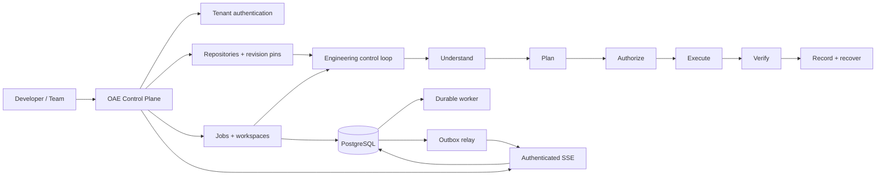

<div align="center">

# OAE · Open Autonomous Engineer

**The governed engineering control plane for software teams.**

OAE helps teams understand repositories, turn evidence into explicit engineering missions, run controlled work, verify outcomes, and retain an auditable operational record.

[](https://github.com/Olori24/oae-core/actions/workflows/ci.yml)
[](https://github.com/Olori24/oae-core/actions/workflows/security.yml)
[](https://www.python.org/)
[](LICENSE)

`UNDERSTAND` · `PLAN` · `AUTHORIZE` · `EXECUTE` · `VERIFY` · `RECORD`

</div>

---

## Table of contents

- [Why OAE](#why-oae)
- [What is available today](#what-is-available-today)
- [Architecture](#architecture)
- [Quick start](#quick-start)
- [API orientation](#api-orientation)
- [Durable jobs and live events](#durable-jobs-and-live-events)
- [Production deployment](#production-deployment)
- [Security posture](#security-posture)
- [Quality gates](#quality-gates)
- [Documentation](#documentation)
- [Contributing](#contributing)

## Why OAE

AI can generate code quickly. Engineering still requires context, constraints, evidence, verification, and accountable decisions. OAE is built for that harder layer of work: it treats an engineering request as a **controlled operational loop**, not simply as a prompt that produces a patch.

> **Autonomous engineering should be governed engineering, not unrestricted automation.**

The system begins with repository facts, represents work as inspectable missions, enforces tenant and policy boundaries, and preserves the evidence needed to explain what happened. It is intentionally designed so that greater automation does not mean less human authority over consequential actions.

| Instead of… | OAE is designed to… |
|---|---|
| Starting with an isolated prompt | Start with repository and tenant context |
| Treating generated code as completion | Require verification evidence before declaring success |
| Giving an agent broad, opaque authority | Route work through explicit controls, scoped permissions, and audit records |
| Keeping operational state in a chat transcript | Persist missions, workspaces, events, and recovery-relevant history |
| Scaling by adding unconstrained agents | Compose specialized capabilities inside a shared engineering boundary |

## What is available today

OAE is an active **v0.6.0 controlled-beta core**. The following capabilities are implemented in this repository and exercised by the automated quality gates.

| Capability | What it provides | Operational boundary |
|---|---|---|
| Tenant control plane | FastAPI service with tenant creation, hashed API keys, authenticated tenant inspection, and tenant-scoped records | A tenant cannot retrieve another tenant’s jobs, repositories, workspaces, or event streams |
| Repository foundations | Tenant-scoped repository registration and immutable revision pinning | Credentials are represented only by external `credential_ref` values; they are not stored in the database |
| Workspace lifecycle | Persistent workspace manifests, quota reservation, retention, and cleanup controls | Shared storage is checked before commitment and cleaned up on failed provisioning |
| Durable job delivery | PostgreSQL-backed job leasing, heartbeats, retries, attempt records, and worker recovery | Enabled only after tracked PostgreSQL migrations and healthy worker processes |
| Transactional events | Atomic outbox writes, leased relay projection, authenticated Server-Sent Events (SSE), cursor replay, and snapshots | Events remain tenant-scoped; stale cursors recover through an authenticated snapshot path |
| Production edge | Docker Compose topology with PostgreSQL, API, worker, relay, migration job, and Caddy HTTPS gateway | The API port remains private; the gateway alone exposes host ports 80 and 443 |
| Quality and supply-chain controls | CI tests, coverage threshold enforcement, Ruff, mypy, dependency audit, secret scanning, and dependency-change review | A passing check is a gate, not a replacement for production validation |

### Deliberate beta limits

OAE does **not** present itself as an unrestricted remote shell or an automatic code-publishing system. The public beta is intentionally constrained to read-oriented engineering workflows while the stronger isolation, authorization, verification, and recovery guarantees are matured. Do not treat future-looking material in the roadmap as a shipped capability.

## Architecture

OAE separates the product boundary from the engineering control loop and from the runtime delivery plane. This protects the core from becoming a flat collection of HTTP handlers or agent tools.



In production, the runtime topology is intentionally explicit:

```text
Internet
   │  HTTPS :443 / HTTP :80
   ▼
Caddy gateway ───────► FastAPI API ───────► PostgreSQL
                              │                  │
                              ▼                  ▼
                        Shared workspace    Durable worker
                                              Outbox relay
```

The API, worker, and relay share one durable authority—PostgreSQL—while the gateway terminates HTTPS and keeps SSE proxy buffering disabled. The full runtime and failure-handling procedure is maintained in the [durable event-delivery runbook](docs/REALTIME_EVENT_DELIVERY_RUNBOOK.md).

## Quick start

### Prerequisites

Local development requires **Python 3.11+** and Git. SQLite supports the basic local-development path. PostgreSQL 16 is required for the durable worker, outbox relay, migration, and live-event capabilities.

### Install

```bash
git clone https://github.com/Olori24/oae-core.git
cd oae-core

python -m venv .venv
. .venv/bin/activate

pip install -r requirements.lock.txt
pip install --no-deps -e .
cp .env.example .env
```

The committed lockfile is the dependency graph used by local development, CI, and container builds. Keep local secrets in `.env`; never commit populated environment files.

### Run the local API

```bash
uvicorn oae.api.app:app --reload
```

The local service then exposes the following useful entry points:

| URL | Purpose |
|---|---|
| `http://127.0.0.1:8000/health` | Service and database health check |
| `http://127.0.0.1:8000/docs` | Interactive OpenAPI reference |
| `http://127.0.0.1:8000/redoc` | Alternative OpenAPI rendering |

### Confirm the local quality gate

```bash
ruff check src tests scripts
mypy src
pytest --cov=oae --cov-report=term-missing --cov-report=json:coverage.json
python scripts/check_coverage_threshold.py --coverage-file coverage.json --threshold 70
```

The repository’s tests are the executable contract. Run focused tests while iterating, then run the full gate before proposing a change for review.

## API orientation

The API uses a tenant API key presented as a Bearer token. Create a tenant once, store the returned key securely, and use that same key for tenant-scoped operations.

```bash
export OAE_URL='http://127.0.0.1:8000'

curl -sS -X POST "$OAE_URL/v1/tenants" \
  -H 'Content-Type: application/json' \
  -d '{"name":"example-engineering-team"}'
```

The response contains the one-time API key. Treat it as a password: OAE stores a hash, not the plaintext value.

```bash
export OAE_API_KEY='oae_...'

curl -sS "$OAE_URL/v1/me" \
  -H "Authorization: Bearer $OAE_API_KEY"
```

| Endpoint | Purpose |
|---|---|
| `GET /health` | Checks API and database availability |
| `POST /v1/tenants` | Creates a tenant and returns a one-time API key |
| `GET /v1/me` | Returns the authenticated tenant identity |
| `POST /v1/repositories` | Registers a tenant-scoped repository connection |
| `POST /v1/repositories/{repository_id}/revisions` | Pins an observed repository revision |
| `POST /v1/jobs` | Queues a supported engineering operation |
| `GET /v1/jobs` / `GET /v1/jobs/{job_id}` | Lists or retrieves tenant-scoped job state |
| `GET /v1/events/snapshot` | Rebuilds the current authenticated event state |
| `GET /v1/events` | Opens a tenant-scoped SSE replay stream |
| `GET /v1/jobs/{job_id}/events` | Opens an SSE stream for one authorized job |
| `GET /v1/workspaces/{workspace_id}/events` | Opens an SSE stream for one authorized workspace |

Use the interactive [`/docs`](http://127.0.0.1:8000/docs) reference as the authoritative request and response contract for the running version.

## Durable jobs and live events

The durable delivery system is intentionally opt-in. It must run against PostgreSQL after the tracked migrations have completed and after at least one worker plus one relay are healthy. Turning the feature flags on against SQLite, or without the supporting processes, is an invalid deployment.

```text
application transaction
        │
        ├── durable job / domain change
        └── outbox event written atomically
                    │
                    ▼
             outbox relay lease
                    │
                    ▼
       authenticated replay log + SSE
                    │
                    ▼
      browser cursor, deduplication, recovery
```

This arrangement avoids declaring an event delivered merely because it was emitted in process. The relay can recover leased work, and clients can replay from a cursor or recover through a snapshot when a cursor expires. Read the [event-delivery runbook](docs/REALTIME_EVENT_DELIVERY_RUNBOOK.md) before activating these flags on any shared environment.

## Production deployment

The production stack is defined by [`docker-compose.production.yml`](docker-compose.production.yml). It starts PostgreSQL, API, worker, relay, and Caddy gateway; the migration service runs as a one-shot tool job. Copy the non-secret template and populate it only through the host or secret-management environment:

```bash
cp .env.production.example .env.production
chmod 600 .env.production
# Set the real domain, generated secrets, exact CORS origin, and PostgreSQL password.
```

The required activation order is deliberate:

```bash
docker compose -f docker-compose.production.yml --env-file .env.production build
docker compose -f docker-compose.production.yml --env-file .env.production up -d db
docker compose -f docker-compose.production.yml --env-file .env.production run --rm migrate
docker compose -f docker-compose.production.yml --env-file .env.production up -d api worker relay gateway
docker compose -f docker-compose.production.yml --env-file .env.production ps
```

Before enabling production traffic, verify database health, worker and relay logs, HTTPS reachability, and one low-risk end-to-end job. The API container intentionally has no public `8000:8000` host binding; Caddy is the only public edge and uses unbuffered forwarding for SSE. The authoritative procedure, rollback controls, and feature-flag preconditions are in the [production runbook](docs/REALTIME_EVENT_DELIVERY_RUNBOOK.md).

### TLS staging dry run

Before a real domain is placed behind the production issuer, use the isolated [Caddy TLS dry-run procedure](docs/CADDY_TLS_DRY_RUN.md). It uses Let’s Encrypt’s staging CA, a disposable hostname, and the `Caddyfile.staging` Compose override so configuration experiments do not consume production issuance limits.

## Security posture

Security is an architectural boundary, not a feature tier. OAE’s controls are designed to keep authority explicit and tenant ownership enforceable.

| Control | OAE position |
|---|---|
| Tenant isolation | Every owned record is scoped to a tenant; authenticated retrieval checks ownership |
| API keys | Returned once, stored as hashes, and sent with `Authorization: Bearer` |
| Repository credentials | Store an external secret reference only; never persist raw credentials in OAE tables |
| Production exposure | API, worker, relay, and database remain private to the Compose network; Caddy exposes 80/443 |
| Real-time delivery | SSE is authenticated, cursor-based, replayable, and protected from proxy buffering |
| Supply-chain checks | Dependency audit, secret scanning, and PR dependency review supplement the CI gate |
| Vulnerability reporting | Report suspected vulnerabilities privately; do not open a public issue |

See [SECURITY.md](SECURITY.md) for automated security checks, reporting guidance, and response expectations. See the [security architecture](docs/architecture/SECURITY_ARCHITECTURE.md) for the broader system model.

## Quality gates

Every production-facing change should include focused regression coverage and pass the repository’s baseline checks.

| Check | Purpose |
|---|---|
| `pytest` with coverage threshold | Behavioural safety net and minimum coverage floor |
| PostgreSQL integration tests in CI | Exercises migrations, outbox relay ordering, and tenant event isolation against a real database service |
| Ruff | Fast static style and correctness checks |
| mypy | Type-oriented checks across source modules |
| Dependency audit | Identifies known vulnerable locked dependencies |
| Secret scan | Detects accidentally committed sensitive material |
| Deployment configuration tests | Protects gateway ports, production environment contract, and SSE proxy rules |

Run `git diff --check` before opening a pull request. A green automated suite is necessary evidence; it is not a substitute for a targeted API, browser, and production smoke test when a change affects a user-facing or operational flow.

## Documentation

The README is the entry point. The documents below provide the next level of detail without duplicating implementation claims.

| Document | Use it when you need to… |
|---|---|
| [Developer beta guide](docs/BETA_DEVELOPER_GUIDE.md) | Follow the intended first-run and feedback workflow |
| [System architecture](docs/architecture/SYSTEM_ARCHITECTURE.md) | Understand the layered engineering-system design |
| [Security architecture](docs/architecture/SECURITY_ARCHITECTURE.md) | Study the security and governance model |
| [Engineering ledger](docs/ENGINEERING_LEDGER.md) | Understand durable engineering evidence and recordkeeping |
| [Event-delivery runbook](docs/REALTIME_EVENT_DELIVERY_RUNBOOK.md) | Activate or operate workers, relay, and SSE delivery |
| [TLS dry-run procedure](docs/CADDY_TLS_DRY_RUN.md) | Validate Caddy and staging ACME before production certificate issuance |
| [Production handoff](docs/PRODUCTION_HANDOFF.md) | Move from a staging TLS proof to a protected host activation and browser-live verification |
| [Developer collaboration guide](docs/DEVELOPER_COLLABORATION.md) | Contribute through bounded changes, evidence-led reviews, and tenant-safe issue workflows |
| [Architecture decisions](docs/adr/README.md) | Review durable technical decisions and their rationale |
| [Repository standards](docs/governance/repository-standard.md) | Follow repository-level engineering expectations |
| [Project charter](docs/OAE_PROJECT_CHARTER.md) | Read the product thesis and long-term direction |

## Contributing

Contributions should preserve OAE’s boundaries: repository understanding before mutation, verification before completion, tenant isolation, recoverability, and auditable operations. Start with [CONTRIBUTING.md](CONTRIBUTING.md), then make focused changes with accompanying tests and documentation.

Before requesting review, run the relevant tests, the full quality gate for wider changes, and `git diff --check`. Do not weaken security controls or tenant checks merely to simplify a demo or fixture. For production-facing work, ask for at least one reviewer and make the operational impact legible in the pull request.

## License

OAE Core is released under the [MIT License](LICENSE).

---

<div align="center">

**OAE · Open Autonomous Engineer**

*Understand the system. Plan the work. Execute with control. Verify the result.*

</div>
