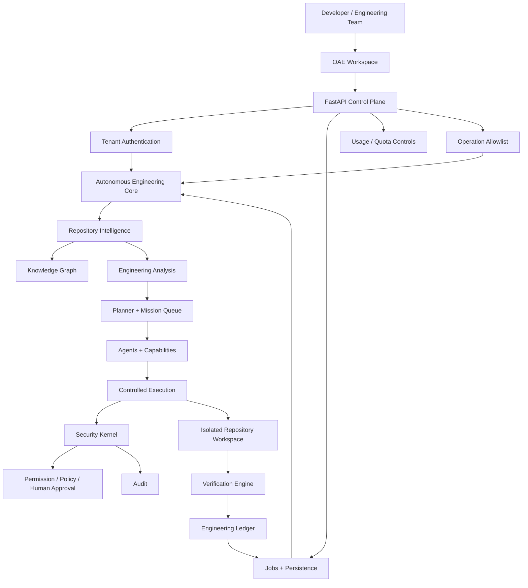
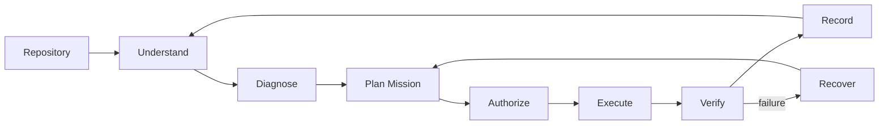
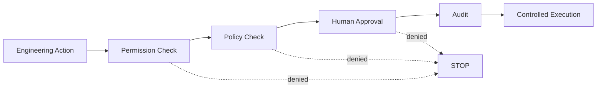

<div align="center">

# OAE
## Open Autonomous Engineer

**The engineering operating system for software that can understand, plan, change, verify, and govern itself.**

[](https://github.com/Olori24/oae-core)
[](https://www.python.org/)
[](https://github.com/Olori24/oae-core)
[](https://github.com/Olori24/oae-core)
[](LICENSE)

**Analyze · Diagnose · Plan · Build · Verify · Govern**

</div>

---

## The short version

Software is becoming easier to generate and harder to engineer well.

Code agents can write a file in seconds. The difficult part is understanding an existing system, deciding what should change, protecting the repository while changing it, proving that the change worked, and keeping humans in control when the consequences matter.

**OAE is built around that problem.**

OAE — Open Autonomous Engineer — is an autonomous engineering operating system that combines repository intelligence, engineering analysis, mission planning, controlled execution, verification, memory, multi-agent coordination, and security governance into one system.

It is not designed as a chatbot that happens to have terminal access.

It is designed as an **engineering control loop**.

```text
                    SOFTWARE REPOSITORY
                            │
                            ▼
                  ┌───────────────────┐
                  │   UNDERSTAND      │
                  │ scan · profile    │
                  │ graph · diagnose  │
                  └─────────┬─────────┘
                            │
                            ▼
                  ┌───────────────────┐
                  │      PLAN         │
                  │ missions · deps   │
                  │ scheduling        │
                  └─────────┬─────────┘
                            │
                            ▼
                  ┌───────────────────┐
                  │   EXECUTE SAFELY  │
                  │ worktrees · patch │
                  │ security gates    │
                  └─────────┬─────────┘
                            │
                            ▼
                  ┌───────────────────┐
                  │     VERIFY        │
                  │ tests · checks    │
                  │ recovery          │
                  └─────────┬─────────┘
                            │
                            ▼
                  ┌───────────────────┐
                  │ GOVERN + RECORD   │
                  │ audit · ledger    │
                  │ human decisions   │
                  └─────────┬─────────┘
                            │
                            └──────► next engineering cycle
```

This loop is the product. The SaaS interface is the access layer around it.

---

## Why OAE exists

Modern software teams are gaining an enormous amount of coding capacity from AI, but raw generation capacity is not the same thing as engineering capacity.

A serious engineering system needs to answer questions such as:

- **What is actually in this repository?**
- **Where are the architectural risks and dependencies?**
- **What should be changed first?**
- **What is safe to change automatically?**
- **What requires human approval?**
- **Did the change actually work?**
- **Can the result be explained, audited, and recovered?**
- **Can multiple engineering agents collaborate without bypassing system controls?**

OAE is being built around those questions.

### The thesis

> **Autonomous software engineering should be governed engineering, not unrestricted automation.**

The goal is not to remove engineers from the loop.

The goal is to give engineers a system capable of doing more of the mechanical, analytical, repetitive, and verifiable engineering work while preserving human authority over consequential decisions.

---

# What makes OAE different

| Conventional AI coding workflow | OAE approach |
|---|---|
| Starts from a prompt | Starts from repository context |
| Generates code | Builds explicit engineering missions |
| Tool calls can become opaque | Operations pass through defined infrastructure |
| Tests are often an afterthought | Verification is a first-class stage |
| Agent authority can be broad | Security and approval gates constrain authority |
| Context is mostly conversational | Repository intelligence + shared engineering memory |
| One agent does everything | Specialized agents cooperate through system infrastructure |
| Success means “the model responded” | Success means “the engineering objective was verified” |

OAE is deliberately closer to an **engineering operating system** than a chat product.

---

# Architecture

The architecture is intentionally layered. The SaaS control plane does not replace the engineering core; it provides a secure product boundary around it.



### Architecture at a glance

**Product boundary**

`Workspace → API → Authentication → Jobs → Tenant isolation`

**Engineering cognition**

`Repository intelligence → Analysis → Planning → Missions`

**Engineering action**

`Agents → Execution → Worktree → Verification`

**Governance**

`Permissions → Policies → Human approval → Audit`

**Continuity**

`Memory → Agent communication → Mission state → Engineering history`

The detailed architecture is maintained in [`docs/architecture.md`](docs/architecture.md).

---

# The OAE engineering loop



Each stage has a job:

1. **Understand** — establish repository facts and structure.
2. **Diagnose** — identify engineering findings, risks, dependencies, and opportunities.
3. **Plan** — convert findings into explicit missions and executable work.
4. **Authorize** — apply security, policy, permissions, and human-approval requirements.
5. **Execute** — perform controlled operations inside the appropriate repository boundary.
6. **Verify** — test and validate the intended outcome.
7. **Record** — preserve engineering state, results, and audit information.
8. **Recover** — return to a safe state when execution or verification fails.

That loop is what allows OAE to move toward autonomous engineering without pretending that autonomy means unlimited authority.

---

# System capabilities

## Repository intelligence

OAE can build an engineering picture of a repository before acting on it.

- Repository scanning and profiling
- Repository context
- Repository knowledge graph
- Dependency analysis
- Dead-code detection
- Circular-dependency detection
- Repository health analysis
- Engineering intelligence reports
- Repository recovery infrastructure
- Workspace/worktree management

## Engineering analysis

The intelligence layer turns repository facts into engineering information.

- Engineering analysis engine
- Semantic repository analysis
- Engineering review capabilities
- Capability discovery
- Dependency resolution
- Code-change planning
- Engineering ledger

## Autonomous engineering

The execution system provides the machinery for controlled engineering work.

- Mission queue
- Scheduling
- Builders and generators
- Application scaffolding
- Patch generation
- Repository execution
- Test execution
- Verification
- Recovery and rollback infrastructure

## Multi-agent engineering

OAE is designed for specialized engineering roles rather than a single monolithic agent.

- Agent runtime
- Agent registry
- Agent message bus
- Shared memory
- Architect capabilities
- Builder capabilities
- Verification capabilities
- Security capabilities
- Backend/DevOps-oriented engineering capabilities
- Engineering action executor

## SaaS control plane

The SaaS layer makes the system accessible to real developers while preserving the underlying engineering boundaries.

- FastAPI application
- Tenant authentication
- Tenant-scoped jobs
- API-key authentication
- Persistent PostgreSQL support
- Local SQLite development fallback
- Usage/quota controls
- Health endpoint
- OpenAPI documentation
- Browser workspace
- Responsive Mission Control experience

---

# Security is part of the architecture

OAE is intentionally **not** an unrestricted remote shell with an AI in front of it.

Consequential operations are governed by the security subsystem.



### Default security posture

- Repository writes require authorization and approval.
- Commit and destructive operations are governed.
- Shell execution is disabled by default.
- File deletion is disabled by default.
- Force-push is disabled by default.
- SaaS operations are explicitly allowlisted.
- API credentials are stored as hashes rather than plaintext secrets.
- Tenant-scoped access is enforced at the application boundary.
- Security decisions are auditable.

These are product invariants, not optional “enterprise features”.

---

# Built for developers first

OAE is being prepared for a controlled beta with **20 developers**.

The beta is intended to answer practical questions, not manufacture vanity metrics:

- Does repository intelligence save meaningful engineering time?
- Are OAE's findings useful enough to influence real development work?
- Does the mission model make autonomous work understandable?
- Are verification and recovery trustworthy?
- Is the security model strong without making the system unusable?
- Can developers understand what OAE is doing without needing the founder beside them?

### Suggested first test

```text
1. Create a developer workspace
2. Authenticate with a dedicated API key
3. Submit a public GitHub repository
4. Inspect repository intelligence
5. Review the resulting engineering mission
6. Run a supported analysis/review/verification operation
7. Inspect the result and mission history
8. Sign out
9. Sign back in
10. Confirm tenant data and history persist
```

The beta is deliberately controlled. Internet-facing users are not given unrestricted repository mutation or shell access.

---

# API surface

The current SaaS control plane exposes a deliberately small initial surface:

| Endpoint | Purpose |
|---|---|
| `GET /` | OAE browser workspace / onboarding |
| `GET /health` | Service health and database status |
| `POST /v1/tenants` | Create a tenant and issue an API key |
| `GET /v1/me` | Inspect the authenticated tenant |
| `POST /v1/jobs` | Queue a supported engineering operation |
| `GET /v1/jobs` | List tenant-scoped jobs |
| `GET /v1/jobs/{id}` | Retrieve one tenant-scoped job |
| `GET /docs` | Interactive OpenAPI reference |

Supported public SaaS operations are intentionally constrained. The API is an access surface into OAE, not a bypass around OAE's governance model.

---

# Repository structure

The repository is organized around system responsibilities rather than a flat collection of features.

```text
src/oae/
│
├── api/             Application and HTTP boundary
├── router/          Application routing
│
├── agents/          Specialized engineering agents
├── agent/           Agent runtime
├── capabilities/    Engineering capabilities
│
├── core/            Core orchestration and engineering engines
├── planner/         Planning and mission infrastructure
├── executor/        Execution infrastructure
├── builder/         Build and generation capabilities
│
├── repository/      Repository-domain infrastructure
├── git/             Git operations
├── memory/          Shared/persistent engineering memory
├── providers/       External providers
│
├── governance/      Governance infrastructure
└── security/        Permissions, policies, approvals and audit

 tests/              Automated test suite
 docs/               Architecture and engineering documentation
 scripts/            Operational/developer scripts
```

This structure is intended to remain modular as OAE grows. New capabilities should have a clear home and should not collapse unrelated concerns into the core.

---

# Quick start

## Requirements

- Python 3.11+
- Git
- PostgreSQL for production
- SQLite is supported as a local-development fallback

## Install

```bash
git clone https://github.com/Olori24/oae-core.git
cd oae-core
python -m venv .venv
. .venv/bin/activate
pip install -e ".[dev]"
```

## Configure

```bash
cp .env.example .env
```

Configure a production PostgreSQL connection and the required application secrets for a deployed environment. Never commit production credentials to Git.

## Run locally

```bash
uvicorn oae.api.app:app --reload
```

Then open:

- `http://127.0.0.1:8000/` — OAE workspace
- `http://127.0.0.1:8000/health` — health check
- `http://127.0.0.1:8000/docs` — OpenAPI documentation

---

# Testing philosophy

OAE treats tests as part of the engineering loop.

The repository has a **773-test local baseline** from the current development history. New changes should preserve the existing suite and add focused coverage where behavior changes.

Run:

```bash
pytest -q
```

Before a production-facing change, validate at least:

```text
unit/integration tests
        ↓
API tests
        ↓
security tests
        ↓
repository execution tests
        ↓
real browser/API smoke test
        ↓
production verification
```

A green unit-test suite is necessary. It is not, by itself, proof that the SaaS is ready for users.

---

# Production model

OAE's serverless API is designed to use persistent PostgreSQL storage in production.

Supported database environment variables include:

- `DATABASE_URL`
- `POSTGRES_URL`
- `POSTGRES_PRISMA_URL`
- `POSTGRES_URL_NON_POOLING`

The deployment must also provide production security configuration such as:

- `APP_ENV=production`
- strong `API_KEY_PEPPER`
- exact allowed hosts
- exact CORS origins
- HTTPS

SQLite remains a local-development convenience. It is **not** the production persistence strategy for a multi-developer SaaS deployment.

The FastAPI entrypoint is explicitly declared in `pyproject.toml`:

```toml
[tool.vercel]
entrypoint = "src.oae.api.app:app"
```

---

# Engineering principles

These principles define OAE's behavior as the system grows.

### 1. Security first

Autonomy without boundaries is not engineering maturity.

### 2. Understand before changing

Repository intelligence comes before repository mutation.

### 3. Plan explicitly

Engineering work should be represented as missions and operations that can be inspected.

### 4. Verify everything that matters

A generated change is not a successful change until the intended result is verified.

### 5. Humans retain consequential authority

OAE can automate engineering work without pretending that every decision should be automated.

### 6. Preserve repository safety

Isolation, worktrees, controlled operations, recovery, and auditability exist because real repositories contain real value.

### 7. Agents are components, not sovereigns

Specialized agents operate inside the OAE architecture and inherit its contracts.

### 8. Documentation follows the implementation

The codebase is the source of truth. Documentation must describe what exists, what is verified, and what is explicitly planned — never imaginary capability.

---

# Documentation map

| Document | Purpose |
|---|---|
| [`docs/architecture.md`](docs/architecture.md) | System boundaries, data flow, execution loop and design invariants |
| [`README.md`](README.md) | Product, architecture, onboarding and developer entry point |
| `tests/` | Executable behavioral contract |
| `pyproject.toml` | Package metadata, dependencies, test configuration and deployment entrypoint |

The documentation follows a simple rule: **learn the product here, understand the architecture in `docs/`, and trust executable code/tests for implementation truth.**

---

# Road to OAE 1.0

OAE is being developed in controlled stages.

### Current focus — controlled SaaS beta

- Real developer onboarding
- Tenant isolation
- API reliability
- Repository intelligence feedback
- Mission usefulness
- Verification quality
- Security validation
- Production observability

### Later scale capabilities

- Durable worker infrastructure
- Private repository authorization through a GitHub App/OAuth model
- Deeper repository write workflows behind explicit approvals
- Billing and plan enforcement
- Expanded observability
- Larger engineering-agent teams

These are deliberately separated from the current beta so that the core product can be validated before the system becomes unnecessarily complex.

---

# The long-term vision

OAE is ultimately aimed at a world where an engineering organization can delegate an increasing amount of software maintenance and improvement to an accountable machine system:

```text
                    HUMAN INTENT
                         │
                         ▼
                  ENGINEERING MISSION
                         │
                         ▼
                OAE UNDERSTANDS SYSTEM
                         │
                         ▼
                  OAE PLANS THE WORK
                         │
                         ▼
               OAE BUILDS / CHANGES
                         │
                         ▼
                  OAE VERIFIES IT
                         │
              ┌──────────┴──────────┐
              │                     │
           VERIFIED             FAILED
              │                     │
              ▼                     ▼
          RECORD / SHIP         RECOVER / REPLAN
              │                     │
              └──────────┬──────────┘
                         ▼
                 HUMAN OVERSIGHT
```

The destination is not “AI writes more code.”

The destination is **software engineering infrastructure capable of understanding systems, executing disciplined work, proving outcomes, and remaining accountable to humans.**

---

# Contributing

OAE is being developed as a modular engineering system. Contributions should preserve the architectural boundaries and security invariants described above.

Before opening a change:

1. Understand the existing subsystem.
2. Identify the narrowest correct layer for the change.
3. Add or update tests.
4. Run the relevant test suite.
5. Run `git diff --check`.
6. Document behavior that materially changes the public contract.
7. Never weaken security controls merely to make tests or demos easier.

---

# License

MIT License. See [`LICENSE`](LICENSE).

---

<div align="center">

**OAE — Open Autonomous Engineer**

*Understand the system. Plan the work. Execute with control. Verify the result.*

</div>
