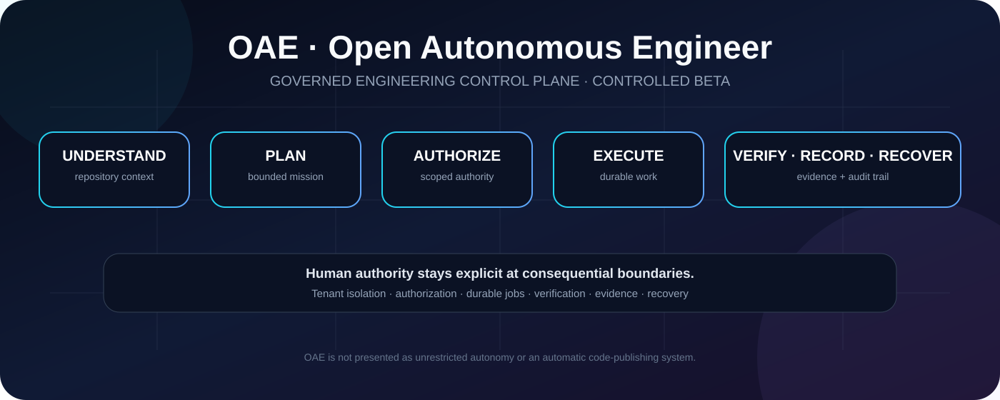
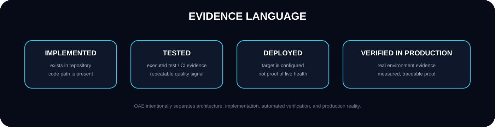
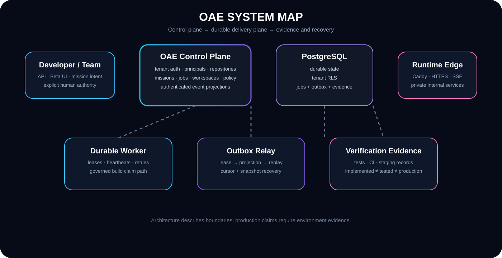
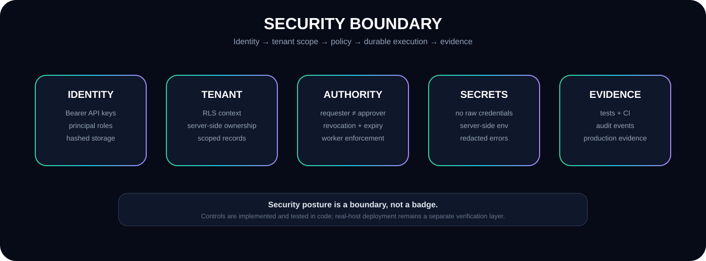

<div align="center">

# OAE · Open Autonomous Engineer

### Governed engineering control plane for AI-assisted software teams

**Understand the system → plan the work → authorize consequential actions → execute durably → verify the result → preserve evidence**

[](#project-status)
[](#project-status)
[](#technology)
[](#technology)
[](#durable-execution)
[](#production-topology)
[](#security-posture)
[](#license)

<br>

**A serious engineering system should not confuse generated output with verified engineering.**

</div>

<p align="center">
  
</p>

---

## ⚡ The idea in one minute

OAE is a **governed engineering control plane** for AI-assisted software work.

It is designed around a simple principle:

> **More automation should increase operational discipline, not remove human authority.**

Instead of treating an engineering request as a prompt that produces an opaque patch, OAE models work as a controlled loop:

**repository context → mission → authorization → execution → verification → evidence → recovery**

The current repository is intentionally scoped. It is a **controlled beta core**, not an unrestricted remote shell, not a magic autonomous programmer, and not an automatic code-publishing service.

### What makes the architecture interesting

| Design principle | OAE interpretation |
|---|---|
| 🧠 **Context first** | Understand repository and tenant context before consequential work |
| 🎯 **Bounded missions** | Work is represented as inspectable operations rather than invisible agent state |
| 🔐 **Explicit authority** | Principal roles, tenant scope and governed worker authorization constrain execution |
| 🧱 **Durable state** | PostgreSQL provides durable jobs, attempts, events and recovery state |
| 🔎 **Verification before confidence** | Tests and CI are evidence; production claims require production evidence |
| ♻️ **Recoverability** | Leases, heartbeats, retries, outbox delivery, cursors and snapshots support recovery |
| 🧾 **Auditability** | Important state transitions and operational evidence remain inspectable |
| 👤 **Human control** | Consequential authority is deliberately kept explicit |

---

# 🧭 Project status

OAE currently describes itself as a **v0.6.0 controlled-beta core**.

The labels below are intentional. They prevent architecture diagrams, code presence and production reality from being treated as the same thing.

<p align="center">
  
</p>

| Label | Meaning |
|---|---|
| 🟢 **IMPLEMENTED** | The capability exists in the repository |
| 🔵 **TESTED** | The capability is exercised by an executed test or CI gate |
| 🟣 **DEPLOYED** | A deployment target or runtime topology is configured |
| 🟠 **VERIFIED IN PRODUCTION** | Real environment evidence proves the behavior |
| ⚪ **ENVIRONMENT-DEPENDENT** | Requires infrastructure, credentials or host conditions outside the repository |
| 🟡 **ROADMAP** | Future work; never presented as shipped capability |

> **Evidence rule:** a green test does not automatically become a production claim. OAE deliberately keeps these labels separate.

---

# 🏗️ Architecture

OAE separates the **product/control boundary**, the **engineering workflow**, and the **durable runtime**.

<p align="center">
  
</p>

### The engineering loop

```text
UNDERSTAND
    ↓
PLAN
    ↓
AUTHORIZE
    ↓
EXECUTE
    ↓
VERIFY
    ↓
RECORD
    ↓
RECOVER / CONTINUE
```

The important architectural decision is the **boundary between intent and authority**.

A user can express intent without automatically receiving unrestricted execution power. A worker can process durable jobs without becoming the source of authorization. A passing test can provide evidence without pretending to be production telemetry.

---

# 🧩 What is available today

| Capability | Status | What it provides | Boundary |
|---|:---:|---|---|
| **Beta workspace UI** | 🟢 🧪 | Workspace creation/API-key sign-in, public repository analysis, mission history and expandable evidence | Guided workflow is intentionally read-oriented |
| **Tenant control plane** | 🟢 🧪 | FastAPI service, tenant creation, hashed API keys and tenant-scoped records | Cross-tenant retrieval is rejected |
| **Principal keys** | 🟢 🧪 | Owner, operator, approver and viewer roles with revocation | Server-side authorization is authoritative |
| **Repository foundations** | 🟢 🧪 | Repository registration and immutable revision pinning | Raw credentials are not persisted; external credential references are used |
| **Workspace lifecycle** | 🟢 🧪 | Persistent manifests, quotas, retention and cleanup controls | Provisioning failures trigger cleanup paths |
| **Durable jobs** | 🟢 🧪 | PostgreSQL-backed leasing, heartbeats, retries, attempts and recovery | Requires PostgreSQL migrations and healthy worker processes |
| **Governed build authorization** | 🟢 🧪 | Tenant-scoped requests, separate approval authority, expiry and revocation | Enforcement is opt-in and requires governed PostgreSQL runtime |
| **Transactional events** | 🟢 🧪 | Atomic outbox writes, relay leasing, authenticated SSE, replay cursors and snapshots | Event access remains tenant-scoped |
| **Database-backed rate limiting** | 🟢 🧪 | Shared control-plane buckets backed by the database | Edge/WAF controls are still recommended for internet-scale abuse resistance |
| **Production topology** | 🟣 | PostgreSQL + API + worker + relay + migration job + Caddy | Host validation is a separate production evidence layer |
| **Supply-chain controls** | 🟢 🧪 | Locked dependency audit, secret scanning, static checks and regression gates | CI is evidence, not a substitute for operational review |

### Deliberate beta limits

OAE **does not** present itself as:

- an unrestricted remote shell;
- a fully autonomous software engineer;
- an automatic code-publishing pipeline;
- a replacement for organizational change management;
- proof that a deployment is production-ready merely because CI is green.

The stronger execution path is deliberately gated. When worker authorization enforcement is enabled, build execution requires an active, tenant-matching authorization and a durable worker capable of confirming that authority.

---

# 🔐 Security posture

Security is treated as an architectural boundary.

<p align="center">
  
</p>

### Security controls

| Control | OAE position |
|---|---|
| **Tenant isolation** | Owned records are tenant-scoped; authenticated retrieval and database RLS reinforce the boundary |
| **PostgreSQL RLS** | Tenant tables use row-level security with forced RLS policies; API sessions bind queries to tenant context |
| **API keys** | Returned once and stored as hashes rather than plaintext |
| **Principal roles** | Owner, operator, approver and viewer roles are enforced server-side |
| **Approval separation** | Requester and approver responsibilities are separated; self-approval is rejected |
| **Build execution** | Governed worker authorization can fail closed when enforcement is enabled |
| **Worker isolation** | Durable worker and relay use a dedicated worker database configuration |
| **Browser credentials** | Persistent `localStorage`/`sessionStorage` API-key storage is intentionally avoided |
| **Repository credentials** | OAE stores external credential references rather than raw repository credentials |
| **Production CORS/hosts** | Production configuration rejects wildcard CORS/host exposure |
| **Security headers** | CSP, HSTS, Permissions-Policy and strict referrer policy are configured at the application/edge boundary |
| **Error handling** | Job failure results and runtime logs avoid persisting raw exception text |
| **Secret scanning** | Gitleaks scans complete Git history in CI |
| **Dependency audit** | Locked dependencies are audited with `pip-audit` |
| **API authorization** | Mutating routes require authenticated principals and server-side role checks |

### Tenant isolation model

The PostgreSQL security layer uses tenant-aware sessions:

```text
authenticated principal
        │
        ▼
  tenant_id resolved
        │
        ▼
db(tenant_id)
        │
        ▼
SET LOCAL oae.tenant_id
        │
        ▼
PostgreSQL RLS policy
        │
        ▼
only rows belonging to that tenant
```

The repository deliberately keeps `api_keys` and `tenants` outside the normal tenant RLS policy because authentication/bootstrap operations must be able to resolve identity before the tenant context exists.

The durable worker and outbox relay are isolated behind a dedicated worker database configuration so cross-tenant queue processing does not require weakening the API's tenant boundary.

> **Deployment note:** PostgreSQL role attributes such as `BYPASSRLS` are deployment responsibilities. The repository configures the separation contract; the actual production login roles must still be provisioned and verified on the target host.

---

# ⚙️ Durable execution

Durable execution is deliberately **opt-in**.

It requires:

- PostgreSQL;
- tracked migrations;
- a healthy durable worker;
- a healthy outbox relay;
- the correct worker database configuration;
- explicit feature-flag activation;
- production/staging verification before consequential execution is enabled.

### Job lifecycle

```text
CREATE
  │
  ▼
QUEUED ──► LEASED ──► RUNNING ──► SUCCEEDED
              │             │
              │             └────► FAILED
              │
              └────────────► RETRY / RECOVERY
```

The worker records attempts and heartbeats rather than relying on process memory as the source of truth.

### Outbox + SSE delivery

```text
application transaction
        │
        ├── domain change
        ├── durable job
        └── outbox event
                │
                ▼
          relay lease
                │
                ▼
       replayable event log
                │
                ▼
       authenticated SSE
                │
        ┌───────┴────────┐
        ▼                ▼
     cursor          snapshot
     replay          recovery
```

This means an event is not considered durable merely because an in-process function emitted it.

See:

- [Realtime event-delivery runbook](docs/REALTIME_EVENT_DELIVERY_RUNBOOK.md)
- [System architecture](docs/architecture/SYSTEM_ARCHITECTURE.md)
- [Engineering ledger](docs/ENGINEERING_LEDGER.md)

---

# 🛡️ Authorization model

OAE uses a principal model instead of a single undifferentiated API key.

| Principal | Intended authority |
|---|---|
| 👑 **Owner** | Tenant administration and high-trust control operations |
| 🛠️ **Operator** | Operational actions within granted server-side boundaries |
| ✅ **Approver** | Approval authority for governed execution |
| 👁️ **Viewer** | Read-only access |

### Governed build authorization

The intended execution path is:

```text
Requester
   │
   ▼
Authorization request
   │
   ├── tenant match
   ├── operation match
   ├── requester role
   └── expiry
   │
   ▼
Independent approver
   │
   ▼
Approved authorization
   │
   ▼
Durable worker claim
   │
   ▼
Execution
```

An authorization can be **pending → approved/rejected → revoked**, with expiry checked at execution time.

This is a focused execution control, not a replacement for an organization's full identity, policy, compliance or change-management system.

---

# 🚀 Quick start

## Prerequisites

- **Python 3.11+**
- Git
- SQLite for the basic local-development path
- **PostgreSQL 16** for durable jobs, outbox relay, migrations and live-event capabilities

## Install

```bash
git clone https://github.com/Olori24/oae-core.git
cd oae-core

python -m venv .venv
. .venv/bin/activate

pip install -r requirements.lock.txt
pip install --no-deps -e .

cp .env.example .env
```

Keep populated environment files local. Never commit secrets.

## Start the API

```bash
uvicorn oae.api.app:app --reload
```

Useful local endpoints:

| URL | Purpose |
|---|---|
| `/health` | API/database health |
| `/docs` | Interactive OpenAPI reference |
| `/redoc` | Alternative OpenAPI rendering |

## Create a tenant

```bash
export OAE_URL='http://127.0.0.1:8000'

curl -sS -X POST "$OAE_URL/v1/tenants" \
  -H 'Content-Type: application/json' \
  -d '{"name":"example-engineering-team"}'
```

The returned API key is shown once. Treat it like a password.

```bash
export OAE_API_KEY='oae_...'

curl -sS "$OAE_URL/v1/me" \
  -H "Authorization: Bearer $OAE_API_KEY"
```

An owner can then issue separate principal keys through `POST /v1/principal-keys`.

---

# 🧭 API orientation

| Endpoint | Purpose |
|---|---|
| `GET /health` | Service and database health |
| `POST /v1/tenants` | Create tenant + one-time owner API key |
| `GET /v1/me` | Inspect authenticated tenant identity |
| `POST /v1/principal-keys` | Issue operator/approver/viewer keys |
| `POST /v1/principal-keys/{key_id}/revoke` | Revoke an issued principal key |
| `POST /v1/worker-authorizations` | Request governed build authority |
| `POST /v1/worker-authorizations/{id}/approve` | Approve a pending authorization |
| `POST /v1/worker-authorizations/{id}/revoke` | Revoke active authorization |
| `POST /v1/repositories` | Register a tenant-scoped repository |
| `POST /v1/repositories/{id}/revisions` | Pin an observed revision |
| `POST /v1/jobs` | Queue a supported engineering operation |
| `GET /v1/jobs` | List tenant-scoped jobs |
| `GET /v1/jobs/{id}` | Retrieve one authorized job |
| `GET /v1/events/snapshot` | Recover authenticated event state |
| `GET /v1/events` | Open tenant-scoped SSE replay |
| `GET /v1/jobs/{id}/events` | Stream one authorized job |
| `GET /v1/workspaces/{id}/events` | Stream one authorized workspace |

For exact request/response schemas, the running OpenAPI document at `/docs` is authoritative.

---

# 🧪 Quality gates

OAE treats the automated suite as an engineering contract.

Run the baseline checks locally:

```bash
ruff check src tests scripts
mypy src

pytest \
  --cov=oae \
  --cov-report=term-missing \
  --cov-report=json:coverage.json

python scripts/check_coverage_threshold.py \
  --coverage-file coverage.json \
  --threshold 70

git diff --check
```

### CI control matrix

| Gate | Why it exists |
|---|---|
| 🧪 **Pytest + coverage** | Behavioral regression protection |
| 🐘 **PostgreSQL integration** | Exercises migrations, durability and tenant event isolation against a real database |
| 🧹 **Ruff** | Static style/correctness checks |
| 🔬 **mypy** | Type-oriented source checks |
| 📦 **Locked dependency audit** | Detects known vulnerable dependencies |
| 🔎 **Gitleaks** | Detects accidentally committed secrets across repository history |
| 🛡️ **Deployment configuration tests** | Protects ports, environment contracts, gateway and SSE behavior |

A green CI run means the tested checks passed. It does **not** automatically certify an external deployment.

---

# 🐳 Production topology

The production topology is intentionally explicit:

```text
                         INTERNET
                            │
                      HTTPS :443
                            │
                            ▼
                    ┌──────────────┐
                    │ Caddy Gateway│
                    └──────┬───────┘
                           │
                    ┌──────▼───────┐
                    │  FastAPI API │
                    └──────┬───────┘
                           │
                  ┌────────▼─────────┐
                  │   PostgreSQL     │
                  │ RLS + durable DB │
                  └────┬────────┬────┘
                       │        │
                 ┌─────▼───┐ ┌──▼─────────┐
                 │ Worker  │ │ Outbox Relay│
                 └─────────┘ └─────────────┘
```

The API, worker, relay and database remain private to the Compose network. Caddy is the public edge.

The repository provides:

- `docker-compose.production.yml`
- `.env.production.example`
- migration service
- Caddy HTTPS gateway
- staging TLS dry-run procedure
- production preflight tooling
- governed execution validation procedure

### Activation order

```bash
docker compose -f docker-compose.production.yml --env-file .env.production build

docker compose -f docker-compose.production.yml \
  --env-file .env.production up -d db

docker compose -f docker-compose.production.yml \
  --env-file .env.production run --rm migrate

docker compose -f docker-compose.production.yml \
  --env-file .env.production up -d api worker relay gateway

docker compose -f docker-compose.production.yml \
  --env-file .env.production ps
```

Do not enable durable production execution merely because containers start. Verify database health, worker/relay health, HTTPS, event delivery and a controlled end-to-end operation on the target environment.

---

# 🗄️ Database and migration model

The PostgreSQL migration history is part of the runtime contract.

Recent security/data-boundary migrations include:

| Migration | Purpose |
|---|---|
| `0007_tenant_row_security.sql` | Enables and forces tenant RLS across tenant-owned tables |
| `0008_job_result_payload.sql` | Adds the persisted durable job result payload |

The API binds tenant-scoped database sessions to the authenticated tenant context.

The durable worker and outbox relay use a separate worker database configuration so operational cross-tenant queue processing does not depend on granting the API broad bypass privileges.

---

# 📚 Documentation map

The README is the visual front door. The repository documentation contains the operational depth.

| Document | Best for |
|---|---|
| [Developer beta guide](docs/BETA_DEVELOPER_GUIDE.md) | First-run developer workflow |
| [UX revival plan](docs/UX_REVIVAL_PLAN.md) | Product/interface decisions and Jakob's Law |
| [System architecture](docs/architecture/SYSTEM_ARCHITECTURE.md) | Layered architecture and boundaries |
| [Security architecture](docs/architecture/SECURITY_ARCHITECTURE.md) | Security and governance model |
| [Engineering ledger](docs/ENGINEERING_LEDGER.md) | Evidence and durable engineering records |
| [Realtime event-delivery runbook](docs/REALTIME_EVENT_DELIVERY_RUNBOOK.md) | Worker, relay and SSE operations |
| [TLS dry-run](docs/CADDY_TLS_DRY_RUN.md) | Safe staging certificate validation |
| [Production handoff](docs/PRODUCTION_HANDOFF.md) | Host activation and browser-live verification |
| [Real-host Phase 2 validation](docs/REAL_HOST_PHASE_2_VALIDATION.md) | Governed authorization and staging proof |
| [Environment placeholder preflight](docs/ENVIRONMENT_PLACEHOLDER_PREFLIGHT.md) | Deployment configuration readiness |
| [Production secret injection](docs/PRODUCTION_SECRET_INJECTION.md) | Protected production secret handling |
| [Staging evidence template](docs/STAGING_TELEMETRY_EVIDENCE_TEMPLATE.md) | Traceable real-host evidence |
| [Open-weight model gateway](docs/OPEN_WEIGHT_MODEL_GATEWAY.md) | Private model endpoint evaluation |
| [Developer collaboration](docs/DEVELOPER_COLLABORATION.md) | Bounded contribution workflow |
| [Architecture decisions](docs/adr/README.md) | Technical decisions and rationale |
| [Repository standard](docs/governance/repository-standard.md) | Repository engineering expectations |
| [Project charter](docs/OAE_PROJECT_CHARTER.md) | Product thesis and long-term direction |
| [Security policy](SECURITY.md) | Security checks and vulnerability reporting |

---

# 🧠 Engineering doctrine

OAE is being built around a few rules that are more important than any individual feature.

### 01 — Context before mutation

Understand the repository and operational context before changing it.

### 02 — Authority before execution

The ability to request work is not automatically the authority to perform every consequential operation.

### 03 — Verification before completion

A generated artifact is not a completed engineering task until the relevant verification evidence exists.

### 04 — Durable state over hidden process memory

If a worker crashes, important operational state should remain recoverable.

### 05 — Tenant boundaries are server-side boundaries

Frontend visibility is never treated as authorization.

### 06 — Secrets are not application data

Credentials belong in controlled secret handling, not ordinary database records or browser persistence.

### 07 — Production is an evidence claim

A deployment target, a passing test and a live production measurement are three different things.

---

# 🗺️ Roadmap

The roadmap intentionally stays separate from shipped capability.

| Direction | Status |
|---|:---:|
| Stronger durable engineering orchestration | 🟡 **ROADMAP** |
| Broader governed repository mutation | 🟡 **ROADMAP** |
| Automated branch/commit/pull-request workflows | 🟡 **ROADMAP** |
| Richer verification/evidence pipelines | 🟡 **ROADMAP** |
| Restart-safe multi-step engineering missions | 🟡 **ROADMAP** |
| Expanded model/provider routing | 🟡 **ROADMAP** |
| Production-scale observability and operational measurement | 🟡 **ENVIRONMENT-DEPENDENT** |

The roadmap is deliberately conservative: future capability is not described as if it already exists.

---

# 🤝 Contributing

Contributions should preserve the system's boundaries:

**IMPLEMENT → TEST → FIX → VERIFY → COMMIT → PUSH → REPORT**

Before opening a pull request:

1. Make the change narrowly.
2. Add or update regression coverage.
3. Run the relevant focused tests.
4. Run the broader quality gate when the change crosses subsystem boundaries.
5. Run `git diff --check`.
6. Document operational or security impact.
7. Separate implementation evidence from deployment claims.

Do not weaken tenant checks, authorization controls or security boundaries to make a demo easier.

Start with [CONTRIBUTING.md](CONTRIBUTING.md).

---

# 📄 License

OAE Core is released under the **Apache License 2.0**. See [LICENSE](LICENSE).

---

<div align="center">

## OAE · Open Autonomous Engineer

**Understand the system. Plan the work. Execute with control. Verify the result.**

*Governed engineering, not unrestricted automation.*

<br>

[](https://github.com/Olori24/oae-core)
[](https://oae-core.vercel.app)

</div>
