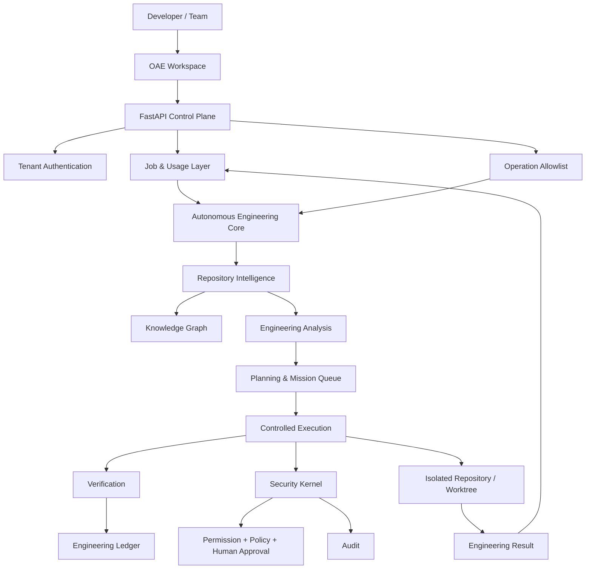
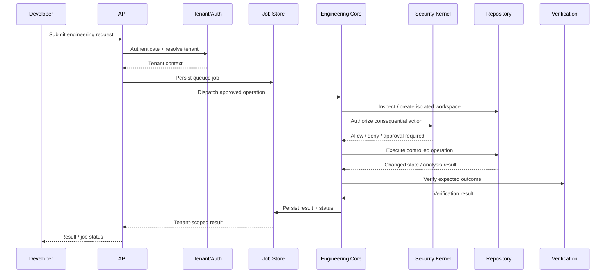
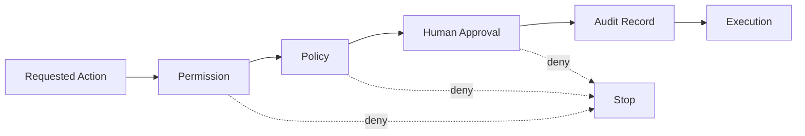
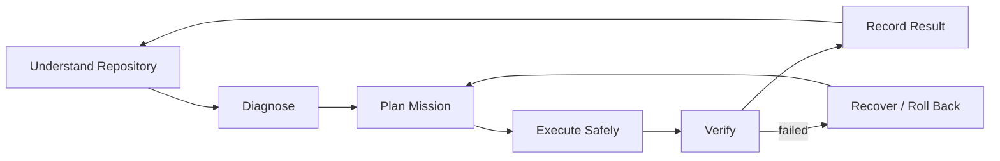
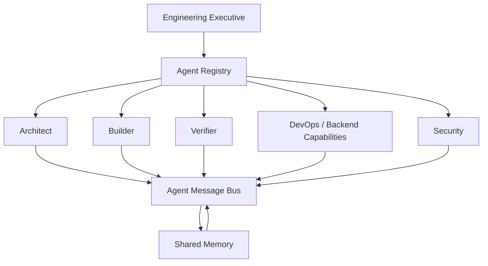

# OAE Architecture

OAE is built as an engineering control system, not as a chat interface with repository tools attached.

The architecture separates **product access**, **engineering cognition**, **controlled execution**, and **governance**. Each layer has a narrow responsibility and communicates through explicit contracts.

## System boundary



## Request lifecycle

A user request is deliberately prevented from jumping directly from HTTP input to arbitrary code execution.



## Layer model

### 1. Product and API layer

**Location:** `src/oae/api`, `src/oae/router`

Responsibilities:

- HTTP/API boundaries
- Authentication and tenant identity
- Request validation
- Job creation and retrieval
- Health and operational endpoints
- Production configuration

This layer is intentionally not responsible for engineering decisions.

### 2. Repository intelligence layer

**Location:** `src/oae/repository`, repository-focused modules under `src/oae/core`

Responsibilities:

- Repository scanning
- Profiling
- Repository context
- Knowledge graph construction
- Dependency analysis
- Dead-code detection
- Circular-dependency detection
- Repository health and intelligence reports

Its job is to establish **what exists and what is known** before engineering action is considered.

### 3. Cognition and planning layer

**Location:** `src/oae/planner`, planning modules under `src/oae/core`

Responsibilities:

- Convert engineering findings into missions
- Break missions into executable work
- Schedule work
- Resolve dependencies
- Maintain engineering intent

The planner should produce explicit work, not hidden side effects.

### 4. Agent and capability layer

**Location:** `src/oae/agents`, `src/oae/capabilities`, `src/oae/agent`

Responsibilities:

- Specialized engineering roles
- Agent registration
- Agent communication
- Engineering action execution
- Domain-specific capabilities

Agents are workers inside the OAE system. They do not bypass the security or verification layers.

### 5. Execution layer

**Location:** `src/oae/executor`, execution modules under `src/oae/core`, `src/oae/builder`

Responsibilities:

- Controlled repository operations
- Worktree isolation
- Patch generation/application
- Application scaffolding
- Repository test execution
- Rollback/recovery paths

Execution is where OAE interacts with real software. Consequently, this layer is constrained rather than given unrestricted authority.

### 6. Governance and security layer

**Location:** `src/oae/governance` and `src/oae/security`

The security model is intentionally stronger than a simple boolean permission check:



Consequential actions such as repository writes, commits, and deletes are governed by permission, policy, and approval requirements. Shell execution and destructive operations remain disabled by default.

### 7. Memory and coordination

**Location:** `src/oae/memory`, `src/oae/meta`, agent communication components

Responsibilities:

- Shared engineering memory
- Agent coordination
- Mission state
- Engineering history/context

Memory supports continuity; it does not become an uncontrolled source of authority.

## Core engineering loop

The fundamental OAE loop is:



This loop is the product philosophy. The SaaS layer exists to make the loop accessible to developers and teams; it does not replace it.

## Multi-agent topology



The purpose of the multi-agent design is specialization without fragmentation. Agents share a common engineering contract and communicate through explicit infrastructure.

## SaaS boundary

The SaaS product is a **controlled access plane** around OAE's engineering core.

```text
                     OAE SaaS
                         │
       ┌─────────────────┼─────────────────┐
       │                 │                 │
 Authentication       Jobs/API          Workspace
       │                 │                 │
       └─────────────────┼─────────────────┘
                         │
                Autonomous Core
                         │
       ┌─────────────────┼─────────────────┐
       │                 │                 │
 Intelligence        Planning         Execution
       │                 │                 │
       └─────────────────┼─────────────────┘
                         │
                   Governance
                         │
                Security + Approval
                         │
                    Verification
```

This separation is important for scale. The product can evolve its web/API experience without weakening the engineering system underneath it.

## Design invariants

These are architectural constraints, not marketing language:

1. **Security precedes consequential execution.**
2. **Repository state is treated as valuable and potentially destructive.**
3. **Engineering work should be observable.**
4. **Verification is a first-class stage, not an afterthought.**
5. **Human approval remains part of the control plane for sensitive actions.**
6. **Tenant boundaries must be enforced at the SaaS boundary and data-access layer.**
7. **Agents operate through OAE infrastructure rather than bypassing it.**
8. **The repository is the source of truth for implementation behavior; documentation must not invent capabilities.**

## Repository map

```text
src/oae/
├── api/            HTTP application and production API boundary
├── agents/         Specialized engineering agents and action execution
├── agent/          Core agent runtime
├── builder/        Build and generation capabilities
├── capabilities/   Domain-specific engineering capabilities
├── core/           Orchestration, intelligence, execution and analysis engines
├── executor/       Execution infrastructure
├── git/            Git operations and repository state
├── governance/     Governance concerns and controls
├── memory/         Shared/persistent engineering memory
├── meta/           System metadata and engineering state
├── planner/        Mission and planning infrastructure
├── providers/      External provider integrations
├── repository/     Repository-domain infrastructure
├── router/         API/application routing
└── security/       Permissions, policies, approvals and audit
```

The directory structure reflects system boundaries rather than a collection of unrelated features. New modules should be placed according to responsibility, not convenience.

## Why this architecture matters

OAE is intended to move from **software understanding** to **controlled software change**.

Most developer AI products optimize the conversation layer. OAE's differentiator is the engineering control loop beneath the interface: repository intelligence, explicit missions, controlled execution, verification, and governance working together.

That is the architecture the SaaS experience should expose and strengthen — not obscure.
